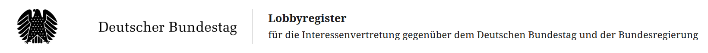

# Collect Lobby Register Data in Germany


## Project Description

This project automates the collection and processing of lobby register data from official German sources. It performs three main functions:

    Downloads PDF documents from the German Lobby Register website

    Combines individual PDFs into a single consolidated document

    Extracts relevant information from the PDFs and converts it to CSV format

### Features

    ⚡ Automated PDF downloading from German Lobby Register

    📂 PDF merging into single file

    🗃️ Data extraction from PDF to structured CSV format

Requirements

    Python 3.x

    Required Python packages (incl. selenium and PyPDF2 -  full list in requirements.txt)

    Internet connection for downloading files

Installation

    Clone this repository

    Install required packages: pip install -r requirements.txt

Usage

Run the main script with:

``` python main.py ```

Output Structure

/output
├── raw_pdfs/           # Downloaded individual PDFs
├── merged.pdf          # Combined PDF
└── lobby_data.csv      # Final extracted data
